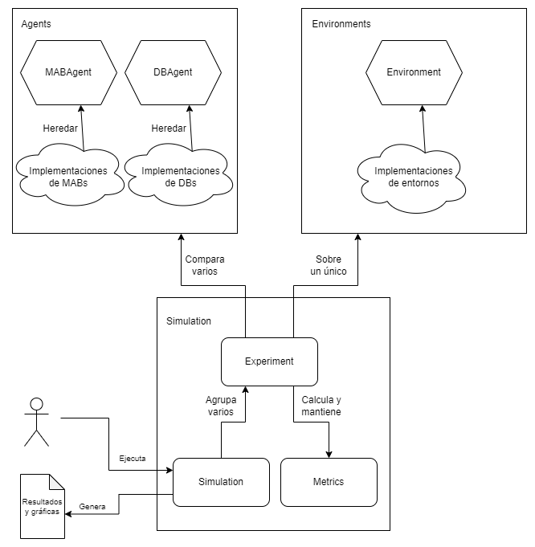

# Librería para simulación con Bandidos Duelistas

Este proyecto forma parte del Trabajo de Fin de Grado de Miguel González González para el título de Ingeniería Informática.

## Resumen

Con el fin de llevar a cabo los experimentos simulados deseados en el estudio del problema de los bandidos duelistas, se ha implementado y documentado una librería para comparar distintas políticas para agentes que se enfrentan al problema de los Bandidos Duelistas (presentado inicialmente en https://www.cs.cornell.edu/people/tj/publications/yue_etal_09a.pdf). La librería está implementada utilizando en todo momento las estructuras y operaciones vectorizadas de NumPy (https://numpy.org/) para una mayor eficiencia. Asimismo, ha sido optimizada en la medida de lo posible con la ayuda del *profiler* *cProfile* (https://docs.python.org/3/library/profile.html#module-cProfile). Las funcionalidades principales soportadas son:

- Implementación de políticas para agentes del problema de bandido multibrazo (MAB) y de los bandidos duelistas (DB).
- Implementación de entornos para bandidos multibrazo (MAB) y bandidos duelistas (DB).
- Definición y ejecución de experimentos, en los que un conjunto deseado de agentes se enfrenta a un entorno predefinido durante el número de épocas establecido y que se repite el número de veces indicado.
- Almacenamiento de distintas métricas que permiten evaluar el rendimiento de cada agente en cada experimento.
- Definición y ejecución de "simulaciones", que son grupos lógicos de experimentos que se ejecutan secuencialmente y cuyos resultados se almacenan de manera conjunta.
- Generación (utilizando PyPlot (https://matplotlib.org/stable/tutorials/introductory/pyplot.html) de MatPlotLib) de gráficas individuales por experimento y agregadas por simulación.

## Estructura de la librería

La librería se divide en tres módulos:

- _agents_: Implementa lo relativo a los agentes para MABs y DBs. Las clases principales que aporta este módulo son *DBAgent* y *MABAgent*, de las cuales puede heredarse para definir agentes personalizados como se explica posteriormente.
- _environments_: Implementa lo relativo a los entornos para MABs y DBs. La clase principal que aporta este módulo es *Environment*, de la cual puede heredarse para definir entornos personalizados como se explica posteriormente.
- _simulation_: Implementa lo relativo a la simulación, almacenamiento de métricas y generación de gráficas.

La estructura se resume en el siguiente diagrama:

## Definición de agentes mediante al módulo _agents_

Para definir un agente DB (respectivamente, MAB), basta con crear una clase que herede de _DBAgent_ (respectivamente _MABAgent_) y sobrescriba los métodos deseados de la siguiente lista (es posible consultar la documetación de la librería para información detallada sobre cada uno):

- *\_\_init\_\_*: Si es necesario almacenar atributos adicionales al crear el objeto o recibir parámetros específicos de la política que se va a implementar.
- *reward*: Si es necesario actualizar el estado del agente cuando recibe una recompensa (en el caso de DBs, el resultado de una comparación).
- *step*: Si es necesario actualizar el comportamiento del agente cuando se solicita el próximo brazo o pareja a tirar.
- *reset*: Si es necesario actualizar la manera de reiniciar el estado del agente.
- *get_name*: Permite devolver una cadena que representa al agente.

La librería incluye implementaciones de los siguientes agentes MAB:

- *Epsilon Greedy*.
- *UCB*
- *Thompson Sampling* con distribución Beta.
- *Thompson Sampling* con distribución Gaussiana.
- *EXP3*

La librería incluye implementaciones de los siguientes agentes DB:

- *Random*
- *Interleaved Filter*
- *Beat the Mean*
- *Sparring*
- *Doubler*
- *MultiSBM*
- *RUCB*
- *CCB*
- *DTS*

## Definición de entornos mediante el módulo _environments_

Para definir un entorno para los agentes MAB y DB, basta con crear una clase que herede de _Environment_ y sobrescriba los métodos deseados de la siguiente lista (es posible consultar la documetación de la librería para información detallada sobre cada uno):

- *\_\_init\_\_*: Si es necesario almacenar atributos adicionales al crear el objeto o recibir parámetros específicos del entorno que se va a implementar.
-  *pull*: Para cambiar la definición de la recompensa numérica que se devuelve al tirar de un brazo dado.
-  *get_probability_dueling*: Para cambiar el cálculo de la probabilidad de que un brazo sea superior a otro.
-  *get_name*: Para cambiar el nombre del entorno.
-  *reset*: Si es necesario actualizar la manera de reiniciar el estado del entorno.
-  *dueling_step*: Si el entorno no se basa en una recompensa numérica subyacente dada por *pull*, permite actualizar el cálculo de los valores devueltos para una comparación por pares solicitada.

La librería incluye implementaciones de los siguientes entornos:

- Brazos con distribución *Bernoulli*.
- Brazos con distribución *Gaussiana*.
- Brazos con distribución *Gaussiana* con ruido añadido por pares.
- Brazos con distribución *piedra-papel-tijeras* por pares.

## Simulaciones, experimentos y métricas con el módulo _simulation_

Para llevar a cabo una simulación, basta con crear un objeto _Simulation_ suministrándole los objetos _Experiment_ deseados. Después, el método _run_all_ ejecuta la simulación. Una vez terminada, puede llamarse a los métodos indicados en la documentación para obtener gráficas de las métricas deseadas. _Simulation_ también permite guardar y cargar estados intermedios mediante _load_state_ y _save_state_, y añadir experimentos posteriormente mediante _add_experiment_. En estos casos, _run_all_ solo ejecutará los experimentos que no hayan sido ejecutados con anterioridad.

Las métricas soportadas por la librería son las siguientes:
  - 'reward': recompensa media obtenida por la pareja (para MABs, recompensa obtenida)
  - 'regret': regret acumulado MAB estándar (para DBs, media del regret estándar de cada elemento de la pareja)
  - 'dueling_regret': regret Copeland acumulado. Para MABs, se calcula con parejas de la forma (i,i) donde i es el brazo accionado. Coincide con el regret acumulado DB estándar en situaciones Condorcet.
  - 'copeland_regret': igual que dueling_regret.
  - 'dueling_regret_non_cumulative': versión no acumulada de dueling_regret.
  - 'copeland_regret_non_cumulative': igual que copeland_regret.
  - 'weak_regret': regret copeland acumulado débil, es decir, solo considerar el mínimo regret de la pareja en lugar de la media.
  - 'strong_regret': regret copeland acumulado fuerte, es decir, solo considerar el máximo regret de la pareja en lugar de la media.
      of the average.
  - 'optimal_percent': porcentaje de ejecuciones del experimento que escogió la mejor opción de brazo disponible.

Pueden encontrarse ejemplos de simulaciones en los ficheros presentes en la raíz del proyecto.

